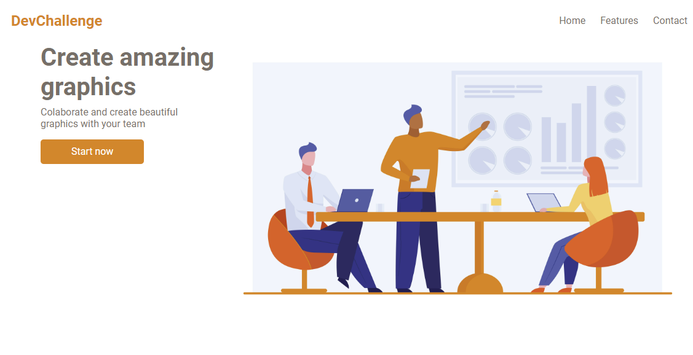

# DevChallenge - Amazing Graph

Essa é uma solução para o desafio de criar uma página sobre um site de criação de gráficos. do site: [DevChallenge](https://www.devchallenge.com.br/).

## 🖥️ Demonstração

## 🔗 Link do site

https://tsb-amazinggraph.netlify.app/

## ℹ️ Sobre

O desafio é criar uma página sobre um site de criação de gráficos. Desafio feito por: [Lorena](https://github.com/Lorenalgm)

## 👨‍💻 Tecnologias

- [HTML](https://developer.mozilla.org/pt-BR/docs/Web/HTML)
- [CSS](https://developer.mozilla.org/pt-BR/docs/Web/CSS)

---

**Desenvolvido por: [Rendell Arruda](https://github.com/rendell-arruda/).**
