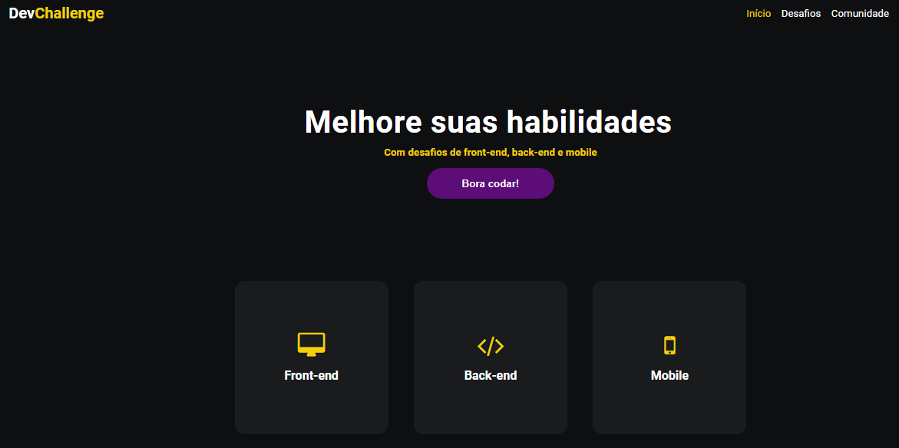

# Dev Challenge

> Este site é um mega repositório com diversos desafios nas áreas de Front-end, Back-end e mobile. Acesse o <a href='https://devchallenge.vercel.app/'>site</a> da plataforma e melhore suas habilidades.

##🗂️ Projetos

O repositório está em constante atualização conforme vou desenvolvendo os projetos. Os seguintes desafios já foram solucionados:

- [x] <a href="https://github.com/rendell-arruda/Dev-Challenge/tree/main/AmazingGraph">AmazingGraph</a>.
- [x] <a href="https://github.com/rendell-arruda/Dev-Challenge/tree/main/codar">Codar </a>.
- [ ] Novo projeto a ser escolhido...

## 👨‍💻 Techs

  

---

<h4 align="center"> 
	🚧   🚀 Em construção...  🚧
</h4>
